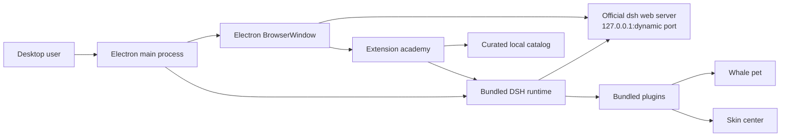

# DeepSeek Harness Desktop GUI Design

**Status:** Approved in conversation on 2026-08-14; this document records the agreed design for final review before implementation planning.

## Product Goal

Build an unofficial, community-maintained DeepSeek Harness desktop distribution for macOS and Windows. The application keeps the official `dsh web` interface intact, starts it reliably without requiring users to install Node.js, and adds three optional layers: a whale-maid desktop pet, a reversible skin center, and a curated extension academy with GitHub links and Chinese tutorials.

The first release optimizes for a small, stable, quickly shippable product. It reuses license-compatible open-source modules instead of redesigning existing solutions.

## Product Positioning

The desktop app will be presented as an unofficial community distribution, not an official DeepSeek product. Its main claims are:

- one-click DeepSeek Harness desktop experience;
- unchanged official Web UI when the default skin is selected;
- reactive whale-maid pet and reversible themes;
- curated extensions, repositories, compatibility information, and Chinese installation tutorials;
- macOS and Windows installers built from the same source tree.

## Scope

### MVP includes

- Electron desktop shell for macOS Apple Silicon, macOS Intel, and Windows x64;
- bundled official `@deepseek-ai/dsh` runtime;
- dynamic loopback port selection through `--host 127.0.0.1 --port 0`;
- startup screen, readable logs, clean shutdown, and child-process-tree cleanup;
- official DSH Web UI loaded in the desktop window;
- bundled whale pet plugin with Harness activity-state reactions;
- skin center with default and Whale Maid skins;
- skin preview, apply, reset, and rollback behavior;
- curated extension academy with repository, license, compatibility, tutorial, and installation actions;
- GitHub Actions builds, packaged smoke tests, checksums, and release artifacts;
- third-party notices and visible unofficial-product wording.

### Explicitly excluded from MVP

- forking or modifying the official Harness chat frontend;
- an online theme marketplace, user accounts, cloud sync, or payments;
- Live2D, voice synthesis, or a free-floating OS-level desktop pet;
- automatic installation of unverified community extensions;
- redistributing unlicensed online fan art;
- mandatory code signing certificates. Signing and notarization are a release-hardening follow-up.

## Reuse Strategy

### Primary desktop shell

Use [`steven-kid/deepseek-harness-desktop`](https://github.com/steven-kid/deepseek-harness-desktop) as the desktop-shell baseline. Reuse its MIT-licensed process launcher, Electron lifecycle, dynamic URL discovery, tests, packaged smoke checks, and multi-platform release workflow. The new repository will have its own name and history rather than GitHub fork metadata.

### Pet, skins, and extension patterns

Selectively reuse BSD-3-Clause components from [`ningbainb/deepseek-harness-desktop`](https://github.com/ningbainb/deepseek-harness-desktop):

- `packages/dsh-pet` for the pet service, client component, activity-state mapping, sprite renderer, settings, persistence, and tests;
- `packages/skins/skin-center` for skin discovery, try-on, apply, reset, mutual exclusion, and rollback;
- `packages/skins/whale-song` as the structural template for the Whale Maid skin;
- the smallest useful subset of desktop extension IPC and UI logic for the curated extension academy.

The large upstream repository will not be copied wholesale. Only modules required by this design will be imported, and unnecessary features will be removed at the boundary rather than carried into the product.

### License handling

The repository will include:

- a license for original project code;
- `THIRD_PARTY_NOTICES.md` containing upstream repository URLs, licenses, copyright notices, and reused paths;
- unmodified copies of required MIT and BSD-3-Clause license text;
- an asset provenance ledger for every bundled image and animation.

MIT and BSD-3-Clause code may be modified and redistributed with their required notices. A new non-Fork repository does not remove attribution obligations. Public binaries will include only upstream-licensed assets, user-owned or commissioned assets, or newly created assets with explicit redistribution permission.

## Architecture



The Electron main process owns runtime startup and shutdown. It launches the bundled DSH CLI with the `web` profile and an operating-system-assigned loopback port, parses the ready URL from stdout, and only then loads the official UI. The renderer does not spawn arbitrary commands directly.

Bundled additions use DSH plugin and Web UI extension interfaces. The default experience remains the official UI; the pet and skin layers can both be disabled.

## Component Boundaries

### Desktop lifecycle service

Responsibilities:

- resolve the packaged DSH entry point;
- launch DSH with a dedicated app data directory;
- parse and validate a `127.0.0.1` ready URL;
- expose startup progress and sanitized logs;
- stop the complete child process tree on app exit;
- report recoverable startup failures without leaving a blank browser window.

It does not manage themes, plugins, or renderer UI.

### Plugin provisioner

Responsibilities:

- install or update only application-bundled, verified plugins into the `web` profile;
- pin each bundled plugin to a tested DSH compatibility range;
- leave existing user-installed extensions intact;
- keep the previous working plugin version when an update fails;
- return a structured result for the startup UI and logs.

Community catalog entries are never silently installed.

### Whale pet plugin

The reused pet plugin remains a standard DSH plugin. Its host half persists settings, affinity, treats, and name. Its client half renders the pet and reacts to Harness state.

Required activity mapping:

| Harness state | Pet animation |
|---|---|
| idle | idle |
| thinking | running |
| tool execution | running-right |
| waiting for user | waiting |
| completed | jumping, then idle |
| failed | failed |

The art contract is a manifest plus a sprite sheet. The initial renderer retains the upstream 8-column by 9-row geometry, with 192 by 208 pixel cells, so replacement artwork does not require lifecycle or plugin changes. If later artwork uses different frame counts, only the manifest and animation tracks change.

### Skin center

The skin center appears under settings rather than replacing official navigation. It offers exactly two built-in choices in MVP:

1. Official Default;
2. Whale Maid.

Preview loads the selected same-origin skin bundle without persisting it. Apply persists the selected skin through the DSH skin mechanism. Reset removes all theme-owned DOM attributes, styles, background values, title, favicon, and chrome changes. Only one skin may be active or previewed at a time.

Whale Maid follows a data-oriented package contract:

```text
themes/whale-maid/
├── theme.json
├── preview-light.webp
├── preview-dark.webp
├── background-light.webp
├── background-dark.webp
├── decorations/
└── pet/
    ├── spritesheet.webp
    └── pet.json
```

Reference images supplied later affect only this asset layer and CSS design tokens. They do not alter desktop startup, the DSH Web UI, extension APIs, or theme-switching behavior.

### Extension academy

The extension academy is a curated guide, not an unrestricted marketplace. It reads a versioned local catalog shipped with the app. Each entry contains:

- stable identifier, name, category, and short description;
- repository and tutorial URLs;
- license and publisher;
- compatible DSH versions;
- trust tier: `bundled`, `verified`, or `community`;
- installation type and exact package specification;
- optional screenshot and restart requirement.

`bundled` and `verified` entries may expose one-click install and uninstall actions after compatibility validation. `community` entries expose only repository, tutorial, and copyable command actions. The first catalog includes the pet, skin center, task board, Git graph, and notifications only when their licenses and current DSH compatibility have been verified.

Tutorial source lives in the repository and is published to GitHub Pages or ordinary GitHub Markdown. The desktop app shows a short local summary and opens the full canonical tutorial.

## Data and Startup Flow

1. Electron creates the application data directory and log stream.
2. The plugin provisioner checks bundled plugin versions and performs reversible updates.
3. The lifecycle service starts packaged DSH on `127.0.0.1` with port `0`.
4. DSH prints its ready URL; the service validates the host and extracts the port.
5. BrowserWindow loads the validated URL.
6. DSH loads the pet and skin plugins through its normal plugin mechanism.
7. Extension academy reads the local catalog and queries installed extension state through constrained IPC.
8. On quit, Electron requests graceful shutdown and then terminates the remaining child process tree within a bounded timeout.

## Error Handling and Recovery

- Runtime-not-found errors produce a diagnostic screen naming the missing packaged file.
- Startup timeout defaults to 60 seconds and shows the last sanitized log lines plus Retry and Open Logs actions.
- Invalid ready URLs are rejected unless the host is exactly `127.0.0.1` or `localhost` and the protocol is HTTP.
- A crashed runtime produces a reconnect screen and one automatic restart; repeated failure waits for explicit Retry.
- Failed bundled-plugin updates restore the previously working plugin and continue with a warning when possible.
- Failed skin preview or apply runs a full reset before reporting the error.
- The extension academy disables one-click installation for incompatible or unverified entries.
- App shutdown always attempts complete process-tree cleanup, including Windows descendants.

## Security Defaults

- BrowserWindow uses `contextIsolation: true`, `nodeIntegration: false`, and a narrow preload API.
- Navigation outside the local DSH origin opens in the system browser.
- Renderer IPC accepts enumerated actions and validated identifiers, never arbitrary shell commands.
- Extension package specifications come from the signed-in-repository catalog for one-click operations.
- API keys stay in DSH storage or OS-backed credential storage and are never written to logs.
- No analytics or telemetry is enabled in MVP.

## Release Design

GitHub Actions builds from tagged commits and runs unit tests plus a packaged smoke test before publishing:

- macOS arm64: DMG and ZIP;
- macOS x64: DMG and ZIP;
- Windows x64: NSIS EXE and ZIP;
- SHA256 checksums for every artifact.

The packaged smoke test starts the application runtime, waits for a valid local ready URL, confirms an HTTP response, and shuts down without leaving child processes. Unsigned development releases must clearly explain macOS Gatekeeper and Windows SmartScreen warnings. Signing and macOS notarization are added when certificates are available.

## Agreed Test Seams

Tests observe behavior only at these public boundaries:

1. **Runtime lifecycle seam:** start returns a validated local URL or a typed startup error; stop leaves no owned child process.
2. **Bundled-plugin seam:** provisioning returns installed, unchanged, restored, or failed outcomes without modifying unrelated user extensions.
3. **Skin seam:** preview changes appearance temporarily; apply persists one skin; reset restores the captured official state after success or failure.
4. **Extension academy seam:** catalog entries produce allowed actions based on trust and compatibility; renderer requests are accepted only through enumerated IPC operations.
5. **Packaged application seam:** a built application starts DSH, serves the official UI, responds over loopback, and exits cleanly.

Tests will not assert private helper calls, exact internal module layouts, or incidental DOM implementation details.

## MVP Acceptance Criteria

- A clean Mac or Windows user can launch the app without installing Node.js or pnpm.
- Startup never depends on a fixed port such as 3080.
- Official Default renders the unmodified DSH Web UI.
- The pet visibly responds to idle, thinking, tool, waiting, completed, and failed states.
- Whale Maid can be previewed, applied, and fully reset without restarting the app.
- The extension academy displays GitHub, license, compatibility, tutorial, and appropriate install actions.
- A failed plugin or skin update preserves or restores the previous working state.
- Quitting the app leaves no owned DSH or Node process.
- CI produces working macOS and Windows artifacts and checksums.
- All shipped source and visual assets have recorded redistribution permission.

## Delivery Order

The product is delivered as independently testable vertical slices:

1. stable desktop shell loading the official UI;
2. bundled plugin provisioning and reactive whale pet;
3. reversible skin center and Whale Maid asset contract;
4. curated extension academy and tutorials;
5. packaging, smoke tests, documentation, and release hardening.

Each slice must remain runnable before the next begins. Features excluded from MVP are not scaffolded in advance.
